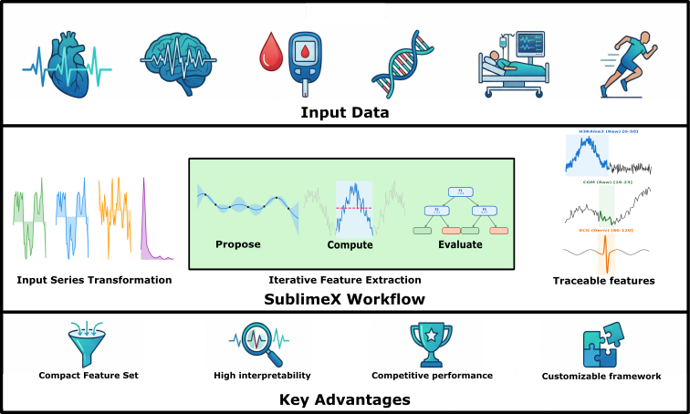

<p align="center">
  
</p>

# SublimeX

**Supervised Bottom-Up Localized Multi-Representative Feature eXtraction**

[](https://badge.fury.io/py/sublimex)
[](https://www.python.org/downloads/)
[](https://opensource.org/licenses/MIT)

SublimeX is an interpretable feature extraction framework for time series and spatial data. It discovers a minimal set of task-specific features through Bayesian optimization, where each feature has explicit, human-readable semantics.

## Key Features

- **Minimal feature sets**: Typically 5-15 features vs. thousands from other methods
- **Full interpretability**: Each feature = statistic over optimized segment of transformed signal
- **Competitive performance**: Matches deep learning on many tasks
- **Modular design**: Custom transforms, objectives, and ML models

## Flowchart of SublimeX pipeline

<p align="center">
  
</p>

## Installation

```bash
pip install sublimex
```

Or install from source:

```bash
git clone https://github.com/Prgrmmrjns/SublimeX.git
cd SublimeX
pip install -e .
```

## Quick Start

Example with **synthetic** multi-channel time series (same flow as `test.py`):

```python
import sublimex as slx
import numpy as np
import pandas as pd
from sklearn.model_selection import train_test_split
from sklearn.metrics import accuracy_score

# --- Synthetic data: multi-channel time series, high noise, weak discriminative bump ---
np.random.seed(42)
n_samples, n_ch, n_time = 400, 5, 100
t = np.linspace(0, 4 * np.pi, n_time)
X_3d = np.zeros((n_samples, n_ch, n_time), dtype=np.float32)
y = np.random.randint(0, 2, n_samples)
for i in range(n_samples):
    for ch in range(n_ch):
        X_3d[i, ch, :] = np.sin(t) + 1.2 * np.random.randn(n_time).astype(np.float32)
    if y[i] == 1:
        X_3d[i, 0, n_time//2 - 12 : n_time//2 + 12] += 0.9  # weak bump in channel 0 for class 1

# --- Train / test split ---
train_idx, test_idx = train_test_split(range(n_samples), test_size=0.2, stratify=y, random_state=42)

# --- Multivariate input: list of DataFrames, one per channel ---
X = [pd.DataFrame(X_3d[:, ch, :]) for ch in range(n_ch)]
X_train = [x.iloc[train_idx] for x in X]
X_test = [x.iloc[test_idx] for x in X]
y_train, y_test = y[train_idx], y[test_idx]

# --- Fit and predict ---
feature_extractor = slx.FeatureExtractor(metric="accuracy", verbose=True, n_trials=100, max_features=5)
feat_train = feature_extractor.fit_transform(X_train, y_train)
feat_test = feature_extractor.transform(X_test)
pred = feature_extractor.model.predict(feat_test)
print(f"Test accuracy: {accuracy_score(y_test, pred):.4f}")
```

**Input format (univariate vs multivariate):**  
- **Univariate:** a single 2D DataFrame or array `(n_samples, n_time)`. SublimeX treats it as one channel.  
- **Multivariate (list):** a list of DataFrames or arrays, one per channel, each shape `(n_samples, n_time)`.  
- **Multivariate (3D array):** a single 3D numpy array `(n_samples, n_channels, n_time)`; SublimeX detects it and uses one channel per slice.

## How It Works

SublimeX discovers discriminative features through a simple but effective process:

1. **Signal Transformation**: Apply multiple transforms to create different "views" of the data (raw, z-score normalized, derivative, FFT power spectrum)

2. **Segment Optimization**: Use Bayesian optimization (Optuna) to find segments that maximize downstream model performance

3. **Feature Extraction**: Compute statistics (e.g., mean) over discovered segments

4. **Iterative Discovery**: Repeat until adding new features no longer improves performance

Each discovered feature is fully interpretable:
> "Mean of z-score normalized signal in channel 2, positions 40-60"

## Configuration

### FeatureExtractor parameters

Each parameter and how it fits the method:

| Parameter | Default | Description |
|-----------|---------|-------------|
| **`metric`** | `'accuracy'` | **Target to optimize.** The downstream model is evaluated on this metric to decide which candidate feature to keep. Use `'accuracy'` for classification accuracy (default), `'auc'` for binary/multi-class ranking, or `'rmse'` for regression. Must match your task (e.g. accuracy for MIT-BIH/PAMAP2, AUC for REMC/MIMIC, RMSE for AZT1D in the paper). |
| **`n_trials`** | `300` | **Bayesian optimization trials per feature.** In each round, the optimizer (TPE) proposes many candidate features (channel, transform, segment boundaries). Each candidate is scored by training the downstream model on current features plus the candidate and evaluating on the validation set. After `n_trials` trials, the best candidate is added. More trials improve search quality at higher cost; the paper uses 300 and ablates 1000. |
| **`max_features`** | `None` | **Maximum number of features to extract.** If `None`, the loop stops only when no candidate improves the validation score (stagnation). Set to an integer (e.g. `5`) to cap the number of features regardless of improvement, useful for fixed-size or ablation experiments. |
| **`inner_cv`** | `1` | **Internal cross-validation folds for evaluating candidates.** With `1`, a single train/validation split is used for all trials in a round, so comparisons are on the same held-out set (recommended in the paper to avoid split variability). Use a larger integer for K-fold validation inside each round. |
| **`val_size`** | `0.5` | **Validation fraction when `inner_cv=1`.** Proportion of training data held out for evaluating candidate features (e.g. `0.5` → 50/50 train/validation split as in the paper). Ignored if `inner_cv > 1`. |
| **`random_state`** | `None` | **Random seed for splits and the optimizer.** Set to an integer (e.g. `42`) for reproducible train/validation splits and Optuna trials. |
| **`verbose`** | `False` | **Print progress.** If `True`, prints sample/channel/time dimensions and per-feature metric after each round. |
| **`show_progress_bar`** | `False` | **Show Optuna progress bar.** If `True`, displays a progress bar for the `n_trials` trials in each round. |
| **`transforms`** | built-in | **Signal transformation library.** Dict of name → callable `(..., n_time) → same shape`. Default: raw, z-score, derivative, FFT power (as in the paper). Custom transforms allow domain-specific views (e.g. wavelets, envelope). |
| **`objective_fn`** | mean | **Objective used by the optimizer.** Signature `(trial, ctx) → float`. Default: mean over the segment (one scalar per sample). The paper notes custom objectives (e.g. median, max) can be plugged in for different aggregations. |
| **`model`** | LightGBM | **Downstream model used to score candidates.** Must implement `evaluate(X_train, y_train, X_val, y_val, metric)` and `test(...)`. Default is LightGBM (classification or regression by `metric`). The paper uses LightGBM with max depth 5; you can pass any sklearn-compatible model wrapper. |

## Extending SublimeX

SublimeX is designed so you can plug in your own components.

| Component | How to extend |
|-----------|----------------|
| **Transforms** | Pass `transforms={'name': fn}`. Each fn receives shape `(..., n_time)` and returns same shape. |
| **Objectives** | Implement `(trial, ctx) -> float`: use `trial.suggest_*` for segment/params, read `ctx['transformed']`, `ctx['n_channels']`, `ctx['n_time']`, etc., set `ctx['last_feature']` when `ctx['extract_only']` is True, else return mean CV score. See `sublimex.objectives` module docstring for full `ctx` fields. |
| **Models** | Any object with `evaluate(X_train, y_train, X_val, y_val, metric) -> float` and `test(X_train, y_train, X_test, y_test, metric) -> float`. Optionally `predict(X)` / `predict_proba(X)` after fitting. See `sublimex.models` module docstring. |

For ablation or fixed-size feature sets, set `max_features=N` so discovery stops after N features even if the metric could still improve.

## Built-in Options

### Transforms

| Transform | Description | Use Case |
|-----------|-------------|----------|
| `raw` | Identity (original signal) | Amplitude differences |
| `zscore` | Z-score normalization | Shape differences |
| `derivative` | First-order gradient | Rate of change, transitions |
| `fft_power` | FFT power spectrum | Frequency content, periodicity |

Default objective is **mean over segment** (one statistic per feature). Custom objectives: pass `objective_fn=(trial, ctx) -> float`.

## Visualization

```python
import sublimex as slx
import matplotlib.pyplot as plt

# Where the first feature's segment falls on the signal
fig = slx.plot_segment_on_signal(data[0], feature_extractor.extracted_features[0], feature_extractor.n_time)
plt.show()
```

## Saving and Loading

```python
import sublimex as slx

# Save discovered features
feature_extractor.save_features('features.json')

# Load and reuse
feature_extractor.load_features('features.json')
new_features = feature_extractor.transform(X_new)
```

## Contributing

Contributions are welcome! Please feel free to submit a Pull Request.

## Citation

If you use SublimeX in your research, please cite our paper (coming soon).